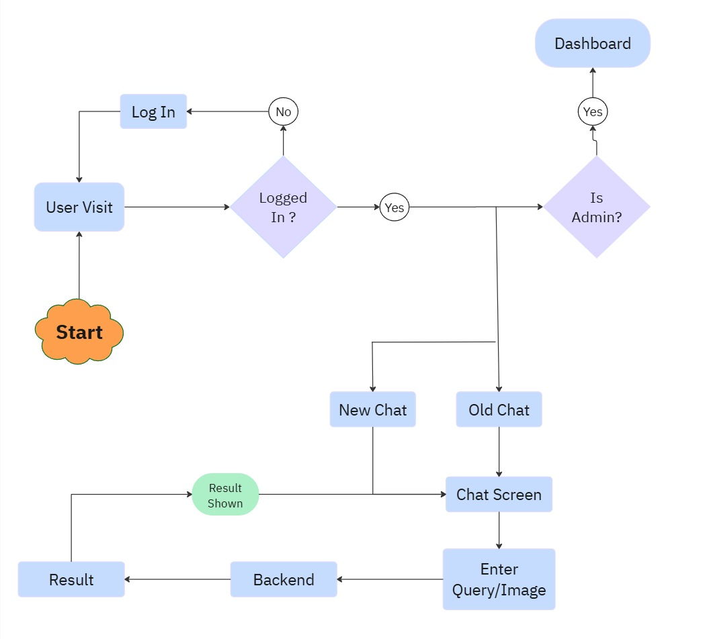
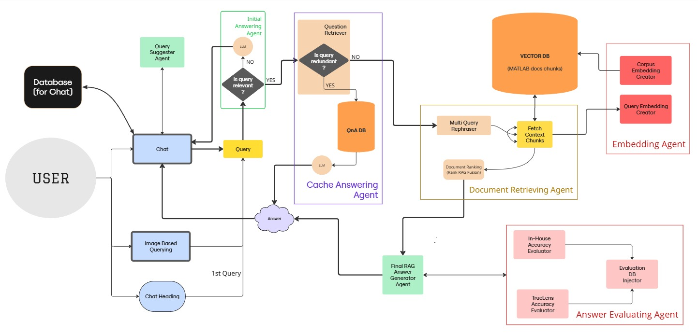

# 🤖 MATLAB Knowledge Assistant


# AI Knowledge Assistant

This project is an AI-powered knowledge assistant designed to help users troubleshoot MATLAB-related issues using retrieval-augmented generation (RAG), multi-agent workflows, and large language models. The system combines LangGraph, FAISS, Gemini, and document retrieval techniques to provide contextual and source-grounded responses through an interactive web interface.
---

## 🛠️ Tech Stack

- **Frontend**: Streamlit
- **Backend**: LangChain,Langgraph, Python, Flask
- **LLMs**: Hugging Face Transformers, Gemini
- **Vector Store**: FAISS
- **Database**: MongoDB
---

## 🚀 Features

- Chat-based troubleshooting for MATLAB errors and syntax
- Chat-based multi-turn troubleshooting with memory.
- Image based trouleshooting for MATLAB errors.
- Citation of sources or documentation sections in responses.
- Analytics dashboard for admin users.
- Contextual query understanding via document retrieval.
- LLM-powered answers based on MATLAB full documentation.
- User-friendly UI interface.
- Multi Chat Sessions maintainenece to access previous chats
- Authentication for user and admin accounts.
- Modular, extensible backend pipeline.

---

## Project Structure 
```
├── backend
│   ├── agents
│   │   ├── answerQnaAgent.py
│   │   ├── answerRagAgent.py
│   │   ├── autocompleteAgent.py
│   │   ├── decisionAgents.py
│   │   ├── imageQueryAgent.py
│   │   ├── intialAnsweringAgent.py
│   │   ├── qnaDbAgents.py
│   │   ├── queryAnnotatorAgent.py
│   │   └── scrapingAgent.py
│   ├── database.py
│   ├── faiss_vector_store
│   │   ├── index.faiss
│   │   └── index.pkl
│   ├── main.py
│   ├── __pycache__
│   │   └── main.cpython-310.pyc
│   ├── qnaDB
│   │   ├── index.faiss
│   │   └── index.pkl
│   └── requirements.txt
├── Backend.jpg
├── frontend
│   ├── app.py
│   └── libs
├── Frontend_UI.jpg
├── README.md
├── results
└── visited.txt
```

## 🧩 Frontend User Flow




---

## 🔧 Backend Flow



---

## ⚙️ Setup Instructions

.env file example (in backend directory) - 

```bask
GEMINI_API_KEY=your_gemini_api
MONGODB_URI=your_database_uri
HUGGINGFACEHUB_API_TOKEN="your_huggingface_api_token"
```


1. Clone the repository:

```bash
git clone https://github.com/your-username/matlab-chatbot.git
cd matlab-chatbot
```
2. Install dependencies:

```bash
pip install -r requirements.txt
```

3. Run the app:

```bash
python backend/database.py
```

```bash
streamlit run frontend/app.py
```

## 📄 Example Queries
[Examples queries](results/)


## Future Improvements

- Support for custom document uploads
- Advanced reranking techniques
- Expanded multi-domain knowledge bases
- Improved citation generation
- Containerized deployment using Docker

